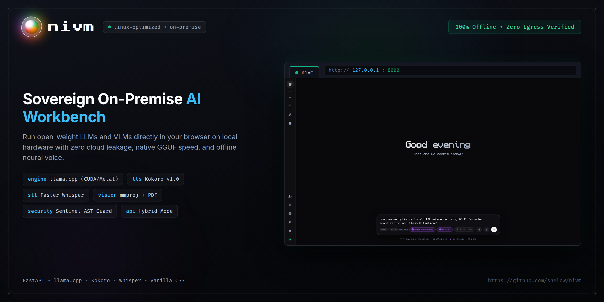
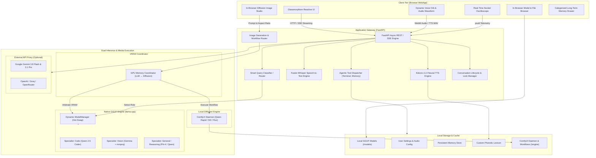

# nivm — Sovereign On-Premise Multimodal AI Workbench

> 100% Offline • Zero Cloud Leakage • Native GGUF Acceleration • Bidirectional Neural Voice • Local Image Studio • Multimodal Vision • Air-Gapped Sentinel

```text
    ███╗   ██╗██╗██╗   ██╗███╗   ███╗
    ████╗  ██║██║██║   ██║████╗ ████║
    ██╔██╗ ██║██║██║   ██║██╔████╔██║
    ██║╚██╗██║██║╚██╗ ██╔╝██║╚██╔╝██║
    ██║ ╚████║██║ ╚████╔╝ ██║ ╚═╝ ██║
    ╚═╝  ╚═══╝╚═╝  ╚═══╝  ╚═╝     ╚═╝
       Native Inference Virtual Machine
```

[](LICENSE)
[](https://python.org)
[](https://fastapi.tiangolo.com)
[](https://github.com/ggerganov/llama.cpp)
[](https://huggingface.co/hexgrad/Kokoro-82M)
[](https://github.com/SYSTRAN/faster-whisper)
[](https://github.com/comfyanonymous/ComfyUI)
[]()

<p align="center">
  
</p>

---

## Overview

> **Note**: This is a personal hobby project built for myself to have a fast, private, all-in-one local AI environment on my own machine—not a commercial product, SaaS, or startup. Feel free to explore, fork, or adapt it for your own personal setups.

**nivm** (*Native Inference Virtual Machine*) is a fully air-gapped local AI workbench built for private technical work. It runs open-weight Large Language Models (LLMs), Vision-Language Models (VLMs), neural speech models, and diffusion image generation pipelines directly on your local hardware with verifiable zero-byte external network egress.

From parsing multi-page technical PDFs and natural bidirectional voice conversations to agentic host terminal execution and local image synthesis, **nivm keeps 100% of your data, models, audio, and visual assets strictly on your physical machine.**

---

## Core Capabilities & Architecture

### 1. Bidirectional Sovereign Voice Engine
- **Neural Speech Synthesis (TTS)**: Built-in Kokoro v1.0 (ONNX Runtime) delivering natural voice synthesis on CPU/GPU with zero GPU VRAM footprint on inference.
- **Vocal Profiles**: Selectable acoustic profiles (Heart, Bella, Sarah, Nicole, Emma/FRIDAY) with audio DSP post-processing (sibilance de-esser, presence EQ, soft fade-out).
- **Offline Speech-to-Text (STT)**: Integrated Faster-Whisper (`/api/stt`) running on CPU with loudness normalization (`pydub`), conversational filler priming, and silence threshold guards.
- **Hands-Free Spacebar Controls**: Tap or hold Spacebar to speak, tap to interrupt agent speech.
- **Dynamic Iridescent Orb**: Real-time frequency-modulated audio visualizer and glowing orb for conversational voice mode (fullscreen and docked).
- **Custom Phonetic Lexicon**: Interactive pronunciation dictionary with live draft audio preview, backed by an offline CMUdict dataset (135,000+ words).

### 2. Dual Inference Architecture & Universal VRAM Management
- **Native GGUF Engine**: Powered by `llama.cpp` with Flash Attention, KV-cache quantization (`q4_0`, `q8_0`, `f16`), split GPU layer offloading, and autonomous intent routing.
- **External Multimodal API Mode**: Seamlessly connect to Google Gemini (e.g. `gemini-3.8-flash`, `gemini-3.1-pro`), OpenAI, Groq, Ollama, LM Studio, or OpenRouter with zero code modifications.
- **Unified Media Pipeline**: Ingest images, multi-page PDFs, audio waveforms, and video keyframes across both local GGUF models (`mmproj`) and external multimodal API endpoints.
- **Universal Model Unload**: One-click VRAM flush button that completely unloads active models from GPU memory into 0MB standby mode.

### 3. Sovereign Image Studio & VRAM Coordinator (ComfyUI Bridge)
- **Local Diffusion Engine**: Integrated local [ComfyUI](https://github.com/comfyanonymous/ComfyUI) bridge supporting Qwen-Rapid, Stable Diffusion, and Flux workflows without external cloud APIs.
- **Dynamic VRAM Coordinator (`vram_coordinator.py`)**: Seamlessly arbitrates GPU memory between `llama.cpp` and ComfyUI. Automatically signals `/free`, flushes CUDA cache, releases diffusion weights, and restores the active LLM without manual restarts or OOM crashes on consumer hardware.
- **In-Browser Image Studio**: Interactive prompt generation, aspect ratio selection, live generation progress cards, auto-setup installer (`nivm/engine/ComfyUI`), and custom directory detection.

### 4. Integrated In-Browser File Explorer
- Browse workstation disks, drives, and directory shortcuts (`Desktop`, `Downloads`, `Home`, `Workspace`, `Models`) directly inside the UI.
- Filter `.gguf` files with instant model activation and automatic companion `mmproj` pairing.

### 5. Reasoning Engine & Anti-Redundancy Pipeline
- Deep reasoning block (`<think>`) extraction and collapsible thinking accordion blocks with rotation indicators and duration counters.
- **Consecutive Paragraph Deduplication**: Automatic detection and elimination of redundant model output loops.
- **Thought-Isolated Tool Parsing**: Private internal reasoning inside `<think>` tags is strictly isolated from tool dispatchers, ensuring thoughts never accidentally trigger false tool calls.
- Audio text sanitization: strips escaped characters (`\n`, `/n`, markdown tags) to prevent verbal clutter in TTS playback.

### 6. Agentic Tool Dispatcher, Safety Sentinel & Conversation Locking
- **Dangerous Command Safety Guard**: Static command risk analyzer inspecting dynamic shell subcommands, pipe-to-shell patterns (`| bash`), root/system redirects, and destructive binaries (`rm`, `sudo`, `dd`, `truncate`, `git reset --hard`, `systemctl`).
- **Interactive Security Modal**: Full-screen backdrop lock (`z-index: 99999`) with focus-trapping, shake animation, and explicit user `Allow` / `Deny` controls before dangerous terminal commands execute.
- **Two-Step Memory Protocol**: Enforced `read_memory` inspection before committing updates via `write_memory`, with automatic JSON/text fact merging (`mergeMemoryValues`) to eliminate data erasure.
- **Agentic Conversation Locking (`end_conversation`)**: Allows the model to lock the chat when objectives are achieved, complete with persistent lock history and an interactive **Model Resume Appeal** dialog.

### 7. Cyber Glassmorphism Interface
- **Interactive Canvas Backgrounds**: Neural Synapses, Matrix Rain, WebGL Fluid Physics, and Cyber Flowfield, with full theme color harmonization.
- **Clear Text Highlight**: Optional frosted glass contrast shield to keep text easily readable over bright motion animations.
- Floating draggable windows, categorized memory drawer, and real-time socket monitoring.

---

## Capability Comparison Matrix

| Capability | Commercial Cloud AI (ChatGPT / Claude) | Standard Local Tools (Ollama / LM Studio) | nivm (This Project) |
| :--- | :---: | :---: | :---: |
| **Data Privacy & Air-Gap** | None (Data leaves premises) | Partial (Silent telemetry/pings) | **100% Air-Gapped & Audited** |
| **Bidirectional Voice (TTS & STT)** | Cloud Stream Only | None / Plugin dependent | **Built-In (Kokoro + Faster-Whisper)** |
| **Hands-Free Spacebar Voice** | Push-to-talk plugin | None | **Tap/Hold to Talk + Tap to Interrupt** |
| **Local Diffusion Image Studio** | Cloud hosted only | Separate tool required | **Integrated (ComfyUI + VRAM Coordinator)** |
| **Dynamic VRAM Arbitration** | N/A | Manual app close/open | **Automatic LLM ↔ Diffusion Swap** |
| **Pronunciation Dictionary** | None | None | **Interactive UI + Live Preview Audio** |
| **Forensic Socket Sentinel** | None | None | **Live Dual-Channel Oscilloscope** |
| **Dynamic Intent Routing** | Monolithic Model | Manual Dropdown Switching | **Autonomous Sub-3s Hot-Swap** |
| **Industrial Document Ingestion** | Cloud Ingestion Only | Basic Image Only | **Multi-Page PDF + mmproj + Video** |
| **OOM-Protected Downloader** | N/A (Cloud hosted) | Crashes host on large pulls | **Isolated Worker (`posix_fadvise`)** |
| **In-Browser File Explorer** | None | Basic OS Dialog Only | **Full Virtual File Navigator** |
| **Dual Mode (Native + Ext API)** | Cloud only | Local only | **Seamless 1-Click Toggle** |

---

## System Architecture



---

## Directory Structure

```text
nivm/
├── core/
│   ├── config.py             # System defaults, LLM hyperparams & base prompts
│   ├── engine.py             # llama.cpp ModelManager with sub-3s model hot-swapping
│   ├── router.py             # Zero-latency local query classifier & intent router
│   ├── models_router.py      # GGUF model scanning, validation & registry
│   ├── multimodal.py         # Faster-Whisper STT, OpenCV keyframing & PDF rasterizer
│   ├── tts.py                # Kokoro v1.0 neural TTS, audio DSP filters & stutter normalizer
│   ├── vram_coordinator.py   # GPU memory coordinator between llama.cpp and ComfyUI
│   ├── chat_manager.py       # Session lifecycle, conversation locking & resume appeal
│   ├── image_router.py       # Diffusion generation routes & ComfyUI daemon bridge
│   ├── image_engine/         # Modular ComfyUI diffusion subsystem
│   │   ├── client.py         # WebSocket & REST client communicating with ComfyUI
│   │   ├── config.py         # Diffusion ports, hosts, model paths & workflow configs
│   │   ├── daemon.py         # ComfyUI process supervisor and background launcher
│   │   ├── downloader.py     # Diffusion checkpoint download manager
│   │   ├── model_checker.py  # Checkpoint, VAE, CLIP & LoRA weight validation
│   │   ├── setup_helper.py   # Automated ComfyUI git cloning & environment setup
│   │   └── workflow_builder.py # Programmatic ComfyUI execution graph builder
│   ├── pronunciation_dict.json # Default phonetic pronunciation lexicon
│   ├── storage.py            # Atomic JSON persistence & settings management
│   ├── file_services.py      # In-browser filesystem navigation & drive shortcuts
│   ├── downloader.py         # Multi-connection aria2 download orchestrator
│   ├── download_worker.py    # Isolated background process with kernel cache eviction
│   ├── network_monitor.py    # Real-time socket monitoring and hardware telemetry
│   ├── benchmark.py          # Token throughput and inference performance benchmarks
│   └── api_v1.py             # OpenAI-compatible API routes
├── models/
│   ├── tts/kokoro/           # Kokoro ONNX model weights & voice embeddings
│   └── *.gguf                # User local GGUF models & mmproj vision projectors
├── static/
│   ├── css/                  # Modular stylesheet architecture
│   │   ├── variables.css     # Color palette, spacing & elevation tokens
│   │   ├── base.css          # Reset, typography & core element styles
│   │   ├── backgrounds.css   # Canvas layer positioning & transitions
│   │   ├── layout.css        # App grid, sidebar, header & chat containers
│   │   ├── modals.css        # Master modal import & layout wrapper
│   │   ├── chat.css          # Master chat import & container rules
│   │   ├── markdown.css      # Syntax highlighting, thinking blocks & clear text highlight
│   │   ├── main.css          # Global entry stylesheet
│   │   ├── chat/             # Scoped chat component styles
│   │   │   ├── chat_layout.css, chat_messages.css, chat_input.css
│   │   │   ├── chat_drawers.css, chat_events.css, chat_media.css
│   │   │   └── chat_notifications.css, chat_voice.css
│   │   └── modals/           # Scoped dialog component styles
│   │       ├── modals_base.css, theme_modal.css, settings_modal.css
│   │       ├── sentinel_modal.css, downloader_modal.css, voice_modal.css
│   │       ├── extras_modal.css, modals_mobile.css
│   ├── js/                   # Modular ES6 JavaScript architecture
│   │   ├── app.js            # Main orchestration & markdown renderer setup
│   │   ├── api.js            # REST & SSE streaming communications
│   │   ├── ui.js             # DOM rendering, reasoning parser & deduplication
│   │   ├── tools.js          # Client tool declarations & execution bridges
│   │   ├── state.js          # Centralized application reactive state
│   │   ├── theme.js          # Dynamic canvas backgrounds & color cycling
│   │   ├── flowfield.js      # Cyber Simplex flowfield engine
│   │   ├── dom.js            # Cached DOM element references
│   │   ├── voice.js          # Voice recording, orb visualizer & Spacebar hotkeys
│   │   ├── chat/             # Scoped chat feature modules
│   │   │   ├── chat_history.js, chat_messages.js, chat_input.js
│   │   │   ├── chat_events.js, chat_media.js, chat_notifications.js
│   │   ├── modals/           # Scoped modal controllers
│   │   │   ├── theme_modal.js, settings_modal.js, sentinel_modal.js
│   │   │   ├── downloader_modal.js, voice_modal.js, extras_modal.js
│   │   │   ├── file_browser.js, tools_settings.js
│   │   ├── media/            # Image & audio preview handlers
│   │   └── memory/           # Categorized memory drawer controller
│   ├── vendor/
│   │   ├── marked.min.js     # Fast markdown parser
│   │   ├── highlight.min.js  # Code syntax highlighting
│   │   ├── webgl-fluid.js    # WebGL fluid physics simulation
│   │   └── ...               # Icons and offline fonts
│   └── index.html            # Main single-page application interface
├── User files/               # User chats, persistent memories & custom pronunciations
├── main.py                   # FastAPI application root & API route bindings
├── requirements.txt          # Python dependency manifest
└── run.sh                    # One-click launch, hardware detector & venv manager
```

---

## Hardware Requirements

| Component | Minimum | Recommended | Workstation |
| :--- | :--- | :--- | :--- |
| **CPU** | 4 Cores (x86_64 / ARM64) | 8 Cores (AVX2 / AVX-512) | 16+ Cores (AMD Threadripper / Intel Xeon) |
| **RAM** | 8 GB DDR4 | 16 GB - 32 GB DDR5 | 64 GB+ ECC RAM |
| **GPU (Optional)** | None (Pure CPU inference) | 6 GB - 8 GB VRAM (RTX 3060 / 4060) | 16 GB - 24 GB VRAM (RTX 4090 / A5000) |
| **Acceleration** | OpenBLAS / CPU threads | CUDA 12.x / Apple Metal / ROCm | Dual GPU with Split Offload |
| **OS** | Linux (Ubuntu, Fedora, Arch, RHEL) | Linux / WSL2 / macOS | Red Hat Enterprise Linux / Rocky Linux |

---

## Quickstart Guide

### 1. Installation

```bash
# Clone the repository
git clone https://github.com/snelow/nivm.git
cd nivm

# Automated setup (creates virtual environment & installs dependencies)
./run.sh --setup
```

### 2. Launch

```bash
# Start the local server
./run.sh
```

The launch script automatically detects:
- GPU hardware and CUDA driver status
- `aria2c` multi-connection downloader availability
- Kokoro Neural TTS model files (downloads automatically if missing)
- Offline CMUdict pronunciation dataset
- ComfyUI diffusion backend presence in `engine/ComfyUI` or custom paths

Navigate to:
```text
http://127.0.0.1:8000
```

### 3. CLI Flags

```bash
./run.sh -h, --help       # Display help menu
./run.sh -p 8080          # Run on custom port (default: 8000)
./run.sh --no-reload      # Run in production mode without hot-reloading
./run.sh --kill           # Terminate any conflicting process bound to port 8000
```

---

## Roadmap

The following capabilities are in active research and planning:

- **On-Premise Document RAG**: Zero-cloud retrieval-augmented generation using an embedded local vector database (ChromaDB / SQLite-vec) with on-device embedding models (`bge-m3` / `nomic-embed`).
- **Sandboxed Code Execution**: Containerized / isolated runtime (via rootless Podman or Linux namespaces) for safely executing and validating model-generated code.
- **Distributed LAN Clustering**: Workstation pooling across machines on the same local network via `llama.cpp` RPC for running large parameter models without single-machine VRAM constraints.

---

## Technology Stack

- **Backend**: Python 3.10+, FastAPI, Uvicorn, Pydantic v2
- **Local Inference Engine**: `llama.cpp`, `llama-cpp-python` (with CUDA / Metal / CPU backends)
- **Neural Speech Synthesis**: Kokoro v1.0 (ONNX Runtime CPU / GPU)
- **Neural Speech-to-Text**: Faster-Whisper (INT8 quantized on CPU via CTranslate2)
- **Generative Media**: ComfyUI (WebSocket & REST API), Qwen-Rapid / SD / Flux workflows
- **Document & Vision Ingestion**: `PyMuPDF` (fitz), `Pillow`, `OpenCV`, `soundfile`, `ffmpeg`
- **Network Telemetry**: `psutil`, HTML5 Canvas 60FPS dual-channel oscilloscope
- **Frontend**: Vanilla ES6 Modules, CSS Glassmorphism design tokens, FontAwesome, WebGL Fluid Physics

---

## License

This project is licensed under the **PolyForm Noncommercial License 1.0.0**.

You are free to view, download, modify, and run this project for **personal, research, educational, and community use**. Commercial use, monetization, selling, or commercial hosting is strictly prohibited without prior explicit permission from the author.
