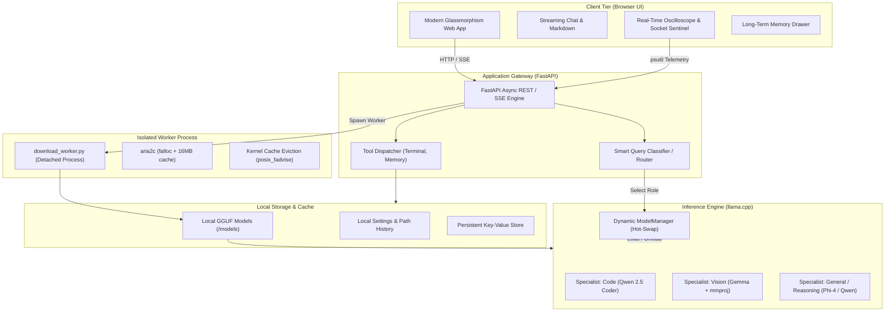

# 🛡️ nivm — Sovereign On-Premise Multimodal AI Workbench

> **100% Offline • Zero Cloud Leakage • Native GGUF Acceleration • Smart Multi-Model Routing • Air-Gapped Sentinel**

```text
    ███╗   ██╗██╗██╗   ██╗███╗   ███╗
    ████╗  ██║██║██║   ██║████╗ ████║
    ██╔██╗ ██║██║██║   ██║██╔████╔██║
    ██║╚██╗██║██║╚██╗ ██╔╝██║╚██╔╝██║
    ██║ ╚████║██║ ╚████╔╝ ██║ ╚═╝ ██║
    ╚═╝  ╚═══╝╚═╝  ╚═══╝  ╚═╝     ╚═╝
   Native Inference Virtual Machine
```

[](LICENSE)
[](https://python.org)
[](https://fastapi.tiangolo.com)
[](https://github.com/ggerganov/llama.cpp)
[]()

---

## 📌 Executive Summary

**nivm** (*Native Inference Virtual Machine*) is an industrial-grade, fully air-gapped local AI workbench engineered for confidential technical work. It enables engineers, researchers, and defense/industrial personnel to run high-performance open-weight Large Language Models (LLMs) and Vision-Language Models (VLMs) directly on local workstations and edge hardware—**with verifiable zero-byte external cloud egress**.

From parsing multi-page confidential PDFs and engineering piping & instrument diagrams (P&IDs) to real-time coding assistance and agentic host terminal execution, **nivm keeps 100% of your data, models, and execution strictly on your physical machine.**

---

## 🚨 The Problem: The Enterprise & Industrial Dilemma

In refineries, manufacturing plants, defense-linked units, and financial institutions, routine technical knowledge work (schematic reviews, engineering calculations, internal tooling scripts, board notes, inspection reports) contains highly sensitive data:
- **P&IDs and Blueprints**: Proprietary design parameters and valve schematics.
- **Financials & Contracts**: Unreleased vendor bids and strategic negotiations.
- **Internal Infrastructure Code**: Credentials, architecture topologies, and private APIs.

Using commercial cloud AI (ChatGPT, Claude, Copilot) violates data sovereignty regulations and risks massive intellectual property leaks. Meanwhile, completely disabling AI results in massive productivity loss. **nivm solves this paradox by bringing the full power of frontier open-weight models to on-premise silicon.**

---

## ✨ Key Highlights & Value Propositions

| Feature | Description |
| :--- | :--- |
| **🔒 100% Verifiable Sovereignty** | Built-in **Network & Socket Sentinel** monitors active OS sockets in real-time, providing hardware-level proof of $0.00\text{ B/s}$ external WAN egress. |
| **🧠 Smart Multi-Model Routing** | A zero-latency local router model triages user queries and hot-swaps specialist GGUFs (Code, Vision, General, Reasoning) in under 3 seconds. |
| **👁️ Deep Multimodal Ingestion** | Native processing of multi-page technical PDFs (`PyMuPDF`), high-resolution visual schematics (`mmproj` vision handler), audio, and video frames. |
| **⚡ Native C++ Hardware Engine** | Powered by `llama.cpp` with Flash Attention, configurable GPU layer offloading (CUDA / ROCm / Metal / CPU), and KV cache quantization (Q8_0 / Q4_0). |
| **🚀 Memory-Safe Isolated Downloader** | Pulls Hugging Face GGUF models via an independent background process (`aria2c` + kernel page cache eviction via `posix_fadvise`) with zero system memory crashes. |
| **🛠️ Agentic Tool Execution** | Built-in long-term key-value memory drawer and secure host terminal execution for autonomous local scripting and verification. |
| **🛡️ Auto-Fallback Safeguard** | Automatically verifies model integrity; if a custom GGUF is missing or corrupt, it instantly reverts to the last-known-good specialist with zero downtime. |

---

## 💡 Core Novelty & Competitive Differentiation

When evaluating on-premise AI, technical evaluators and compliance judges frequently ask: **"How is this different from Ollama, LM Studio, or a generic chat wrapper?"**

`nivm` is fundamentally architected for **zero-trust industrial environments**, introducing five distinct technical novelties:

### 1. 🔍 Forensic Proof of Sovereignty (vs. "Blind Trust")
- **The Status Quo**: Existing tools (Ollama, LM Studio, Open WebUI) claim to run locally, but frequently ping external registries, update servers, and telemetry beacons in the background without user visibility.
- **The nivm Novelty**: Introduces a real-time, hardware-level **Network & Socket Sentinel**. By hooking directly into kernel process tables via `psutil`, `nivm` monitors every active socket descriptor and renders a live dual-channel CRT oscilloscope proving **0.00 B/s external WAN egress**. It delivers mathematically auditable, forensic proof of isolation to security officers.

### 2. ⚡ Autonomous Specialist Routing & Hot-Swapping (vs. Monolithic GPU Hogging)
- **The Status Quo**: Running a single 70B+ model to handle both coding and visual tasks demands costly $15,000+ multi-GPU enterprise servers. Alternatively, switching models in UI dropdowns takes 30–60 seconds and fragments memory.
- **The nivm Novelty**: An agile **Specialist-Orchestrated Architecture**. A microsecond local classifier triages intent and dynamically swaps dedicated compact specialists (e.g., Qwen 2.5 Coder vs. Gemma Vision with `mmproj`) in **under 3 seconds**. It achieves frontier-class quality across diverse domains on standard, affordable consumer workstations (RTX 3060/4060 or Apple Silicon).

### 3. 📐 Native Industrial Multimodal Ingestion (vs. Simple Image Pasting)
- **The Status Quo**: Most local tools only accept simple pasted JPEGs or offload OCR to cloud APIs.
- **The nivm Novelty**: A native multi-format pipeline combining `PyMuPDF` for vector document page rasterization, OpenCV for video frame sampling, and direct GGUF multimodal projector (`mmproj`) binding. It digests full engineering P&IDs, blueprints, and multi-page technical reports completely offline without external OCR binaries.

### 4. 🛡️ Kernel-Guarded, Process-Isolated Model Provisioning (vs. OOM Daemon Crashes)
- **The Status Quo**: Downloading 15GB–20GB GGUF models inside the server process causes Linux dirty-page buffer bloat and system memory thrashing, frequently triggering the kernel OOM killer and killing active LLM sessions.
- **The nivm Novelty**: Complete process isolation via a detached worker (`download_worker.py`) running in its own OS process group. By combining `falloc` instant block pre-allocation with Linux kernel page cache eviction (`posix_fadvise(POSIX_FADV_DONTNEED)`), worker resident memory remains strictly **under 25MB RSS** throughout 20GB+ downloads.

### 5. 🔄 Self-Healing Model Registry with Auto-Fallback (vs. Fatal Crashes)
- **The Status Quo**: Missing, renamed, or corrupted model files cause unhandled Python exceptions and immediate server failure.
- **The nivm Novelty**: Built-in state verification and dynamic fallback. If a selected model fails integrity or path checks, `nivm` seamlessly falls back to the last-known-good specialist with zero downtime, notifying the user via non-blocking toast alerts.

### 🥊 Feature Comparison Matrix

| Capability | Commercial Cloud AI (Claude / ChatGPT) | Standard Local Tools (Ollama / LM Studio) | **nivm (This Project)** |
| :--- | :---: | :---: | :---: |
| **Data Privacy & Air-Gap** | ❌ None (Data leaves premises) | ⚠️ Partial (Silent telemetry/pings) | **✅ 100% Air-Gapped & Audited** |
| **Forensic Socket Sentinel** | ❌ None | ❌ None | **✅ Live Dual-Channel Oscilloscope** |
| **Dynamic Intent Routing** | ❌ Monolithic Model | ❌ Manual Dropdown Switching | **✅ Autonomous Sub-3s Hot-Swap** |
| **Industrial Document Ingestion** | ⚠️ Cloud Ingestion Only | ❌ Basic Image Only | **✅ Multi-Page PDF + P&ID + mmproj** |
| **OOM-Protected Downloader** | N/A (Cloud hosted) | ⚠️ Crashes host on large pulls | **✅ Isolated Worker (posix_fadvise)** |
| **Self-Healing Fallback** | ❌ Server Error 500 | ❌ Process Crash | **✅ Instant Revert to Known-Good** |
| **Host Terminal Tool Execution** | ❌ Sandboxed/Restricted | ❌ Chat Only | **✅ Integrated Agentic Execution** |

---

## 🏛️ System Architecture



---

## 🔬 Deep-Dive: Core Modules

### 1. Dynamic Multi-Model Orchestration (`engine.py` & `router.py`)
Instead of forcing a single massive model to handle every task (which hogs 32GB+ of VRAM), `nivm` uses an agile specialist approach:
- **Router Role**: Evaluates incoming context (tokens, file attachments, intent) with minimal overhead.
- **Coder Role** (`Qwen2.5-Coder`): Specialized in Python, C++, Bash, SQL, and architectural logic.
- **Vision Role** (`Gemma-VLM` + `mmproj`): High-fidelity visual OCR and schematic inspection.
- **Single Model Mode**: Allows manual override to any custom GGUF with path history memory and automatic corruption fallback.
- **Sub-3s Hot Swapping**: Frees host RAM via rigorous pointer deallocation and garbage collection before instantiating the new model.

### 2. Multimodal Technical Document Pipeline
- **PDF Page Rasterization**: Uses `PyMuPDF` to render engineering PDFs at 300 DPI directly into RGB pixel buffers.
- **Vision Projector Integration**: Utilizes `llama-cpp-python`'s CLIP/Gemma multimodal chat handler (`mmproj-*-BF16.gguf`) to bind visual tokens directly into the LLM context.
- **Media Support**: Automatically extracts frames from `.mp4`/`.mkv` videos and audio tracks for multi-angle inspection.

### 3. Memory-Isolated Model Downloader (`download_worker.py`)
Downloading 10GB–20GB GGUF models often crashes systems due to RAM buffer accumulation:
- **Complete Decoupling**: Launched via `subprocess.Popen(..., start_new_session=True)` in an isolated OS process group.
- **Hardware-Level Allocation**: Uses `--file-allocation=falloc` and `-x 4 -s 4` with `--disk-cache=16M` to prevent Linux kernel dirty-page bloat.
- **Zero-RAM Streaming Fallback**: Built-in HTTP chunked streamer calls `os.posix_fadvise(fd, 0, 0, POSIX_FADV_DONTNEED)` every 16MB, commanding the Linux kernel to flush written chunks from page cache. Memory usage stays **under 25MB RSS** regardless of file size.
- **Hugging Face Direct**: Automatically normalizes any pasted Hugging Face `/blob/` web link into a direct streaming `/resolve/` endpoint.

### 4. Network & Hardware Sentinel (`network_monitor.py`)
- **Oscilloscope**: Dual-channel CRT-style oscilloscope displaying live local loopback throughput (`127.0.0.1`) while proving external WAN egress is flatlined at $0.00\text{ B/s}$.
- **Forensic Sockets Table**: Uses `psutil` to inspect every open socket descriptor bound to the application process, verifying strict loopback isolation.

---

## 📊 Hardware Requirements & Compatibility

| Component | Minimum | Recommended | Industrial / Workstation |
| :--- | :--- | :--- | :--- |
| **CPU** | 4 Cores (x86_64 / ARM64) | 8 Cores (AVX2 / AVX-512) | 16+ Cores (AMD Threadripper / Intel Xeon) |
| **RAM** | 8 GB DDR4 | 16 GB - 32 GB DDR5 | 64 GB+ ECC RAM |
| **GPU (Optional)** | None (Pure CPU inference) | 6 GB - 8 GB VRAM (RTX 3060 / 4060) | 16 GB - 24 GB VRAM (RTX 4090 / A5000) |
| **Acceleration** | OpenBLAS / CPU threads | CUDA 12.x / Metal / ROCm | Dual GPU with Split Offload |
| **OS** | Linux (Ubuntu, Fedora, RHEL) | Linux / WSL2 / macOS | Red Hat Enterprise Linux / Rocky Linux |

---

## ⚡ Quickstart Guide

### 1. Installation

```bash
# Clone the repository
git clone https://github.com/your-org/nivm.git
cd nivm

# Automated setup (creates virtualenv & installs all dependencies)
./run.sh --setup
```

### 2. Launch the Workbench

```bash
# Start the local server
./run.sh
```

Open your browser and navigate to:
```text
http://127.0.0.1:8000
```

### 3. Model Setup
1. Open the **Settings Modal** (gear icon in the sidebar).
2. Use the **Download Model** card to paste any Hugging Face GGUF link (e.g., `https://huggingface.co/bartowski/Qwen2.5-Coder-3B-Instruct-GGUF/blob/main/...`).
3. Click **Download**—the isolated downloader will fetch the model with live speed, ETA, and progress tracking.
4. Click **Load Engine** to activate instant offline inference!

---

## 🔮 Roadmap & Planned Implementations

To evolve `nivm` from a local multi-model prototype into a full-scale industrial agentic workbench, the following subsystems are actively planned:

### 1. 🤖 Multi-Step Agentic Planning & Real Deliverables Generation
- **Iterative Task Execution**: Transition beyond single-turn prompt-response into autonomous, multi-step goal execution where the agent breaks down complex objectives, calls local tools, inspects outputs, and self-corrects until deliverables meet quality checks.
- **Production Office Deliverable Exporters**:
  - **Formal Approval Notes & Reports (`.docx`)**: Automated templating for engineering sign-offs, executive briefs, and regulatory audit notes.
  - **Engineering Calculations & Tabular Worksheets (`.xlsx`)**: Generation of spreadsheet calculation workbooks with formulas, unit validations, and visible step-by-step arithmetic proofs.
  - **Board & Plant Presentations (`.pptx`)**: Direct conversion of multi-page inspection summaries into structured presentation decks.

### 2. 📚 Sovereign On-Premise Knowledge Base (Air-Gapped RAG Connector)
- **Local Document Grounding**: A zero-cloud RAG pipeline linking local engineering manuals, Standard Operating Procedures (SOPs), plant maintenance logs, and historical internal correspondence.
- **Embedded Offline Vector Database**: Integration with local vector engines (ChromaDB / SQLite-vec) powered by on-device embedding models (e.g., `bge-m3` or `nomic-embed` via `llama.cpp`) ensuring 100% air-gapped retrieval.

### 3. 🧪 Isolated Sandboxed Code Execution
- **Kernel-Level Sandboxing**: Containerized local runtime environments (via rootless Podman, Docker, or Linux `firejail`) to safely execute and benchmark model-generated Python scripts, shell utilities, and data processing jobs without exposing the host OS.
- **Automated Verification Loops**: Self-evaluating execution cycles where test suites automatically grade and refine code outputs before presentation to the user.

### 4. 📝 On-Device Handwritten OCR & Field Document Parsing
- **Handwritten Notes & Inspection Checklists**: Specialized fine-tuned local vision-language adapters capable of parsing rough handwriting, physical field logs, and degraded thermal printouts.
- **High-Resolution Vector Blueprint Zooming**: Intelligent tiled windowing for 4K+ resolution engineering schematics and complex electrical line diagrams.

### 5. 🎨 Local Generative Media Pipeline (Image & Audio Generation via ComfyUI)
- **ComfyUI Local Bridge**: Headless IPC/REST bridge connecting `nivm` to a local [ComfyUI](https://github.com/comfyanonymous/ComfyUI) instance for fully offline visual generation (Stable Diffusion / Flux) to render technical concept diagrams, 3D component renders, and visual asset variations without external cloud APIs.
- **Local Audio & Speech Suite**:
  - **Offline Speech-to-Text (STT)**: Integration with `whisper.cpp` for local transcription of equipment acoustic inspections and voice prompts.
  - **Local Text-to-Speech (TTS)**: Low-latency neural speech synthesis (Piper / Kokoro / AudioGen) for voice readbacks of critical alerts and approval summaries.

### 6. 🌐 Distributed LAN Clustering
- **Workstation Tensor Parallelism**: Pooling compute and VRAM across multiple local workstations on the same air-gapped internal LAN via `llama.cpp` RPC, enabling fluid execution of 70B+ reasoning models across existing company hardware.

---

## 🛠️ Technology Stack

- **Backend**: Python 3.10+, FastAPI, Uvicorn, Pydantic v2
- **Inference Engine**: `llama.cpp`, `llama-cpp-python` (with CUDA/Metal/CPU backend)
- **Document & Media Ingestion**: `PyMuPDF` (fitz), `Pillow`, `OpenCV`, `pydub`, `ffmpeg`
- **Download Acceleration**: `aria2c` (4-stream falloc) + POSIX page cache eviction
- **Forensic Telemetry**: `psutil`, Canvas HTML5 60FPS dual-channel oscilloscope
- **Frontend**: Vanilla HTML5, Modern CSS (Glassmorphism design system), ES6 Modules, FontAwesome

---

## 📄 License

This project is licensed under the **MIT License** — free for personal, academic, and enterprise evaluation.
