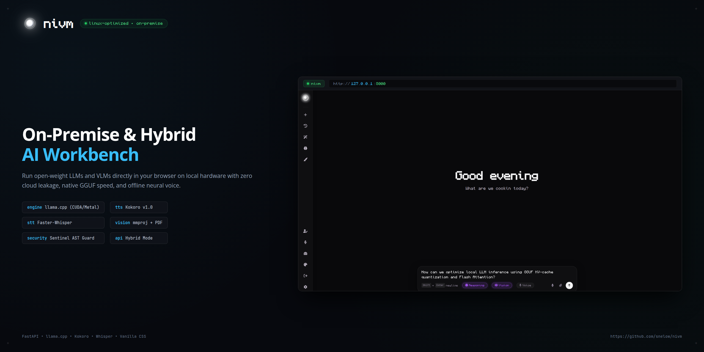
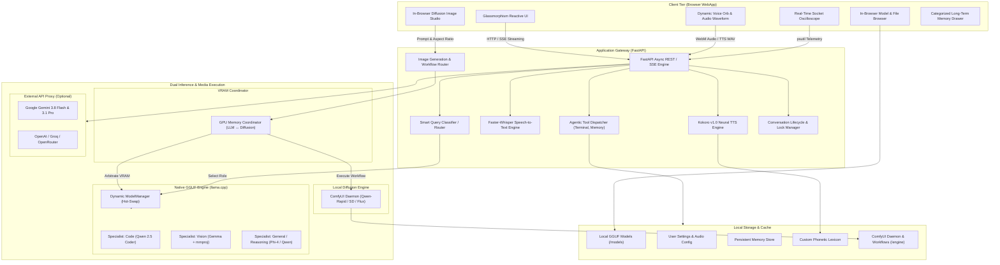

# Project NIVM — On-Premise & Hybrid Multimodal AI Workbench

> Private Intelligence • Native GGUF Acceleration • Hybrid API Mode • Bidirectional Neural Voice • Local Image Studio • Multimodal Vision • Sentinel

```text
    ███╗   ██╗██╗██╗   ██╗███╗   ███╗
    ████╗  ██║██║██║   ██║████╗ ████║
    ██╔██╗ ██║██║██║   ██║██╔████╔██║
    ██║╚██╗██║██║╚██╗ ██╔╝██║╚██╔╝██║
    ██║ ╚████║██║ ╚████╔╝ ██║ ╚═╝ ██║
    ╚═╝  ╚═══╝╚═╝  ╚═══╝  ╚═╝     ╚═╝
       Native Inference Virtual Machine
```

[](LICENSE)
[](https://python.org)
[](https://fastapi.tiangolo.com)
[](https://github.com/ggerganov/llama.cpp)
[](https://huggingface.co/hexgrad/Kokoro-82M)
[](https://github.com/SYSTRAN/faster-whisper)
[](https://github.com/comfyanonymous/ComfyUI)
[]()

<p align="center">
  
</p>

---

## Overview

> **Note**: This is a personal hobby project built for myself to have a fast, private, all-in-one local AI environment on my own machine—not a commercial product, SaaS, or startup. Feel free to explore, fork, or adapt it for your own personal setups.

**Project NIVM** (*Native Inference Virtual Machine*) is a private multimodal AI workbench built for technical work. It runs open-weight Large Language Models (LLMs), Vision-Language Models (VLMs), neural speech models, and diffusion image generation pipelines directly on your local hardware while also supporting external OpenAI-compatible API providers (Gemini, Claude, Groq, OpenAI).

From parsing multi-page technical PDFs and natural bidirectional voice conversations to agentic host terminal execution and local image synthesis, **Project NIVM puts you in complete control of your data, models, audio, and visual assets.**

---

## Core Capabilities & Architecture

### 1. Bidirectional Neural Voice Engine
- **Neural Speech Synthesis (TTS)**: Built-in Kokoro v1.0 (ONNX Runtime) delivering natural voice synthesis on CPU/GPU with zero GPU VRAM footprint on inference.
- **Vocal Profiles**: Selectable acoustic profiles (Heart, Bella, Sarah, Nicole, Emma/FRIDAY) with audio DSP post-processing (sibilance de-esser, presence EQ, soft fade-out).
- **Offline Speech-to-Text (STT)**: Integrated Faster-Whisper (`/api/stt`) running on CPU with loudness normalization (`pydub`), conversational filler priming, and silence threshold guards.
- **Hands-Free Spacebar Controls**: Tap or hold Spacebar to speak, tap to interrupt agent speech.
- **Dynamic Iridescent Orb**: Real-time frequency-modulated audio visualizer and glowing orb for conversational voice mode (fullscreen and docked).
- **Custom Phonetic Lexicon**: Interactive pronunciation dictionary with live draft audio preview, backed by an offline CMUdict dataset (135,000+ words).

### 2. Dual Inference Architecture & Universal VRAM Management
- **Native GGUF Engine**: Powered by `llama.cpp` with Flash Attention, KV-cache quantization (`q4_0`, `q8_0`, `f16`), split GPU layer offloading, and autonomous intent routing.
- **MoE (Mixture of Experts) Architecture Support**: Dynamic detection of MoE topologies (active vs. total experts, routed layers) with single-GPU memory threshold advisories.
- **Interactive VRAM & KV Cache Memory Estimator**: Visual calculator projecting model weights and KV cache memory footprint across context lengths (4K–128K) before loading models into VRAM.
- **External Multimodal API Mode**: Seamlessly connect to Google Gemini (e.g. `gemini-3.8-flash`, `gemini-3.1-pro`), OpenAI, Groq, Ollama, LM Studio, or OpenRouter with zero code modifications.
- **Unified Media Pipeline**: Ingest images, multi-page PDFs, audio waveforms, and video keyframes across both local GGUF models (`mmproj`) and external multimodal API endpoints.
- **Universal Model Unload**: One-click VRAM flush button that completely unloads active models from GPU memory into 0MB standby mode.

### 3. Integrated Image Studio & VRAM Coordinator (ComfyUI Bridge)
- **Local Diffusion Engine**: Integrated local [ComfyUI](https://github.com/comfyanonymous/ComfyUI) bridge supporting Qwen-Rapid, Stable Diffusion, and Flux workflows without external cloud APIs.
- **Dedicated Anime Pipeline (Illustrious SDXL)**: Optional character synthesis engine with LoRA management (characters, outfits, hairstyles, poses), Danbooru tag compiler, and 8-step LCM Turbo mode for rapid generation on consumer GPUs (4GB+ VRAM).
- **In-Browser Image Studio**: Interactive prompt and character manager, live generation progress cards with action pills, host disk LoRA import, and conversational multi-turn follow-up editing.
- **Dynamic VRAM Coordinator (`vram_coordinator.py`)**: Seamlessly arbitrates GPU memory between `llama.cpp` and ComfyUI. Automatically signals `/free`, flushes CUDA cache, releases diffusion weights, and restores the active LLM without manual restarts or OOM crashes on consumer hardware.

### 4. Integrated In-Browser File Explorer
- Browse workstation disks, drives, and directory shortcuts (`Desktop`, `Downloads`, `Home`, `Workspace`, `Models`, `LoRAs`) directly inside the UI.
- Filter `.gguf` and `.safetensors` LoRA files with instant model activation and automatic companion `mmproj` pairing.

### 5. Reasoning Engine & Anti-Redundancy Pipeline
- Deep reasoning block (`<think>`) extraction, unclosed thought recovery (`sealUnclosedThoughts`), and collapsible thinking accordion blocks with rotation indicators and duration counters.
- **Consecutive Paragraph Deduplication**: Automatic detection and elimination of redundant model output loops.
- **Thought-Isolated Tool Parsing**: Private internal reasoning inside `<think>` tags is strictly isolated from tool dispatchers, ensuring thoughts never accidentally trigger false tool calls.
- Audio text sanitization: strips escaped characters (`\n`, `/n`, markdown tags) to prevent verbal clutter in TTS playback.

### 6. Agentic Tool Dispatcher, Safety Sentinel & Conversation Locking
- **Single-User Owner Security & Session Lock**: Local owner authentication (`core/auth.py`), encrypted session tokens, emergency recovery key, and lock screen overlay with Silk Flow canvas.
- **Dangerous Command Safety Guard**: Static command risk analyzer inspecting dynamic shell subcommands, pipe-to-shell patterns (`| bash`), root/system redirects, and destructive binaries (`rm`, `sudo`, `dd`, `truncate`, `git reset --hard`, `systemctl`).
- **Interactive Security Modal**: Full-screen backdrop lock (`z-index: 99999`) with focus-trapping, shake animation, and explicit user `Allow` / `Deny` controls before dangerous terminal commands execute.
- **Two-Step Memory Protocol**: Enforced `read_memory` inspection before committing updates via `write_memory`, with automatic JSON/text fact merging (`mergeMemoryValues`) to eliminate data erasure.
- **Agentic Conversation Locking (`end_conversation`)**: Allows the model to lock the chat when objectives are achieved, complete with persistent lock history and an interactive **Model Resume Appeal** dialog.

### 7. Cyber Glassmorphism Interface
- **Interactive Canvas Backgrounds**: Neural Synapses, Matrix Rain, WebGL Fluid Physics, and Cyber Flowfield, with full theme color harmonization.
- **Clear Text Highlight**: Optional frosted glass contrast shield to keep text easily readable over bright motion animations.
- Floating draggable windows, categorized memory drawer, and real-time socket monitoring.

---

## Capability Comparison Matrix

| Capability | Commercial Cloud AI (ChatGPT / Claude) | Standard Local Tools (Ollama / LM Studio) | nivm (This Project) |
| :--- | :---: | :---: | :---: |
| **Data Privacy & Air-Gap** | None (Data leaves premises) | Partial (Silent telemetry/pings) | **100% Air-Gapped & Audited** |
| **Bidirectional Voice (TTS & STT)** | Cloud Stream Only | None / Plugin dependent | **Built-In (Kokoro + Faster-Whisper)** |
| **Hands-Free Spacebar Voice** | Push-to-talk plugin | None | **Tap/Hold to Talk + Tap to Interrupt** |
| **Local Diffusion & Anime Studio** | Cloud hosted only | Separate tool required | **Integrated (Qwen-Rapid + Illustrious SDXL + VRAM Coordinator)** |
| **Dynamic VRAM Arbitration** | N/A | Manual app close/open | **Automatic LLM ↔ Diffusion Swap** |
| **Pronunciation Dictionary** | None | None | **Interactive UI + Live Preview Audio** |
| **Forensic Socket Sentinel** | None | None | **Live Dual-Channel Oscilloscope** |
| **Dynamic Intent Routing** | Monolithic Model | Manual Dropdown Switching | **Autonomous Sub-3s Hot-Swap** |
| **Industrial Document Ingestion** | Cloud Ingestion Only | Basic Image Only | **Multi-Page PDF + mmproj + Video** |
| **OOM-Protected Downloader** | N/A (Cloud hosted) | Crashes host on large pulls | **Isolated Worker (`posix_fadvise`)** |
| **In-Browser File Explorer** | None | Basic OS Dialog Only | **Full Virtual File Navigator** |
| **Dual Mode (Native + Ext API)** | Cloud only | Local only | **Seamless 1-Click Toggle** |

---

## System Architecture


```mermaid
flowchart TB
    subgraph Client ["Client Tier (Browser WebApp)"]
        UI["Glassmorphism Reactive UI"]
        VoiceOrb["Dynamic Voice Orb & Audio Waveform"]
        ImgStudio["In-Browser Diffusion Image Studio"]
        NetMon["Real-Time Socket Oscilloscope"]
        FileNav["In-Browser Model & File Browser"]
        MemUI["Categorized Long-Term Memory Drawer"]
    end

    subgraph Gateway ["Application Gateway (FastAPI)"]
        API["FastAPI Async REST / SSE Engine"]
        TTS["Kokoro v1.0 Neural TTS Engine"]
        STT["Faster-Whisper Speech-to-Text Engine"]
        Router["Smart Query Classifier / Router"]
        Tools["Agentic Tool Dispatcher (Terminal, Memory)"]
        ChatMgr["Conversation Lifecycle & Lock Manager"]
        ImgRouter["Image Generation & Workflow Router"]
    end

    subgraph Storage ["Local Storage & Cache"]
        ModelsDir["Local GGUF Models (/models)"]
        SettingsJSON["User Settings & Audio Config"]
        MemoryJSON["Persistent Memory Store"]
        PronounceJSON["Custom Phonetic Lexicon"]
        ComfyEngine["ComfyUI Daemon & Workflows (/engine)"]
    end

    subgraph Engines ["Dual Inference & Media Execution"]
        subgraph LocalEngine ["Native GGUF Engine (llama.cpp)"]
            ModelMgr["Dynamic ModelManager (Hot-Swap)"]
            CoderModel["Specialist: Code (Qwen 2.5 Coder)"]
            VisionModel["Specialist: Vision (Gemma + mmproj)"]
            GeneralModel["Specialist: General / Reasoning (Phi-4 / Qwen)"]
        end
        subgraph VRAMArbitration ["VRAM Coordinator"]
            VRAMCoord["GPU Memory Coordinator (LLM ↔ Diffusion)"]
        end
        subgraph DiffusionEngine ["Local Diffusion Engine"]
            ComfyBridge["ComfyUI Daemon (Qwen-Rapid / SD / Flux)"]
        end
        subgraph ExternalAPI ["External API Proxy (Optional)"]
            GeminiAPI["Google Gemini 3.8 Flash & 3.1 Pro"]
            OpenAIAPI["OpenAI / Groq / OpenRouter"]
        end
    end

    UI -->|HTTP / SSE Streaming| API
    VoiceOrb -->|WebM Audio / TTS WAV| API
    ImgStudio -->|Prompt & Aspect Ratio| ImgRouter
    NetMon -->|psutil Telemetry| API
    API --> Router
    API --> TTS
    API --> STT
    API --> ChatMgr
    ImgRouter --> VRAMCoord
    VRAMCoord -->|Arbitrate VRAM| ModelMgr
    VRAMCoord -->|Execute Workflow| ComfyBridge
    Router -->|Select Role| ModelMgr
    ModelMgr --> LocalEngine
    API --> ExternalAPI
    API --> Tools
    Tools --> Storage
    TTS --> PronounceJSON
    FileNav --> ModelsDir
    ComfyBridge --> ComfyEngine
```

---

## Directory Structure

```text
nivm/
├── core/
│   ├── auth.py               # Single-user owner authentication & session token manager
│   ├── config.py             # System defaults, LLM hyperparams & base prompts
│   ├── engine.py             # llama.cpp ModelManager with sub-3s model hot-swapping
│   ├── router.py             # Zero-latency local query classifier & intent router
│   ├── models_router.py      # GGUF model scanning, validation & registry
│   ├── multimodal.py         # Faster-Whisper STT, OpenCV keyframing & PDF rasterizer
│   ├── tts.py                # Kokoro v1.0 neural TTS, audio DSP filters & stutter normalizer
│   ├── vram_coordinator.py   # GPU memory coordinator between llama.cpp and ComfyUI
│   ├── chat_manager.py       # Session lifecycle, conversation locking & resume appeal
│   ├── image_router.py       # Diffusion generation routes & ComfyUI daemon bridge
│   ├── image_engine/         # Modular ComfyUI diffusion subsystem
│   │   ├── client.py         # WebSocket & REST client communicating with ComfyUI
│   │   ├── config.py         # Diffusion ports, hosts, model paths & workflow configs
│   │   ├── daemon.py         # ComfyUI process supervisor and background launcher
│   │   ├── downloader.py     # Diffusion checkpoint download manager
│   │   ├── model_checker.py  # Checkpoint, VAE, CLIP & LoRA weight validation
│   │   ├── setup_helper.py   # Automated ComfyUI git cloning & environment setup
│   │   ├── workflow_builder.py # Programmatic ComfyUI execution graph builder
│   │   └── illustrious/      # Illustrious SDXL anime character generation pipeline
│   │       ├── characters.py # Curated character presets and LoRA triggers
│   │       ├── config.py     # Illustrious paths and model definitions
│   │       ├── prompt_builder.py # Danbooru tag compiler & prompt enhancer
│   │       └── workflow_builder.py # Dynamic SDXL / LCM Turbo graph generator
│   ├── pronunciation_dict.json # Default phonetic pronunciation lexicon
│   ├── storage.py            # Atomic JSON persistence & settings management
│   ├── file_services.py      # In-browser filesystem navigation & drive shortcuts
│   ├── downloader.py         # Multi-connection aria2 download orchestrator
│   ├── download_worker.py    # Isolated background process with kernel cache eviction
│   ├── network_monitor.py    # Real-time socket monitoring and hardware telemetry
│   ├── benchmark.py          # Token throughput and inference performance benchmarks
│   └── api_v1.py             # OpenAI-compatible API routes
├── models/
│   ├── tts/kokoro/           # Kokoro ONNX model weights & voice embeddings
│   ├── image/                # Diffusion UNet, VAE, LoRAs & checkpoints
│   └── *.gguf                # User local GGUF models & mmproj vision projectors
├── static/
│   ├── sw.js                 # Service worker caching & PWA offline handling
│   ├── offline.html          # Interactive Cyber Arcade offline fallback screen
│   ├── manifest.json         # Progressive Web App (PWA) manifest
│   ├── css/                  # Modular stylesheet architecture
│   │   ├── variables.css     # Color palette, spacing & elevation tokens
│   │   ├── base.css          # Reset, typography, reduced motion & core styles
│   │   ├── backgrounds.css   # Canvas layer positioning & transitions
│   │   ├── layout.css        # App grid, sidebar, header & chat containers
│   │   ├── markdown.css      # Syntax highlighting, thinking blocks & clear text highlight
│   │   ├── main.css          # Global entry stylesheet
│   │   ├── chat.css          # Chat module entry stylesheet
│   │   ├── modals.css        # Modals module entry stylesheet
│   │   ├── chat/             # Scoped chat component styles
│   │   │   ├── chat_drawers.css, chat_events.css, chat_input.css
│   │   │   ├── chat_layout.css, chat_media.css, chat_messages.css
│   │   │   └── chat_mobile.css, chat_notifications.css, chat_voice.css
│   │   └── modals/           # Scoped dialog & modal component styles
│   │       ├── auth_modal.css, downloader_modal.css, extras_modal.css
│   │       ├── global_search_modal.css, image_studio.css, modals_base.css
│   │       ├── modals_mobile.css, sentinel_modal.css, settings_modal.css
│   │       └── theme_modal.css, voice_modal.css
│   ├── js/                   # Modular ES6 JavaScript architecture
│   │   ├── app.js            # Main orchestration & coordinator setup
│   │   ├── api.js            # REST & SSE streaming communications
│   │   ├── auth.js           # Owner authentication, session tokens & lock screen
│   │   ├── ui.js             # UI module barrel, DOM rendering & formatting
│   │   ├── tools.js          # Client tool declarations & execution bridges
│   │   ├── state.js          # Centralized reactive application state
│   │   ├── theme.js          # Dynamic canvas backgrounds & color cycling
│   │   ├── backgrounds.js    # Canvas visualizers & procedural rain/nodes
│   │   ├── flowfield.js      # Cyber Simplex flowfield engine
│   │   ├── think_tags.js     # Reasoning tag recovery & thinking accordion logic
│   │   ├── image_editor.js   # In-browser diffusion canvas & asset editor
│   │   ├── dom.js            # Dynamic DOM proxy with automatic node caching
│   │   ├── voice.js          # Voice recording, orb visualizer & Spacebar hotkeys
│   │   ├── extras.js         # Miscellaneous UI actions & helpers
│   │   ├── chat/             # Scoped chat feature modules (3 core controllers)
│   │   │   ├── chat_history.js   # History drawer, session loading & reconciliation
│   │   │   ├── chat_messages.js  # Message rendering, action buttons & Markdown
│   │   │   └── chat_stream.js    # Streaming response handler & SSE client
│   │   ├── modals/           # Scoped modal controllers
│   │   │   ├── settings_modal.js, theme_modal.js, voice_modal.js
│   │   │   ├── global_search_modal.js, image_studio_modal.js, personality_modal.js
│   │   │   └── file_browser.js, tools_settings.js, sentinel_modal.js, dialogs.js
│   │   ├── media/            # Media manager & interactive lightbox
│   │   │   └── media_manager.js
│   │   └── memory/           # Categorized memory drawer controller
│   │       └── memory_drawer.js
│   ├── vendor/               # Offline vendor assets (highlight.js, marked, three.js)
│   └── index.html            # Main single-page application interface
├── User files/               # User chats, persistent memories, auth & certificates
├── main.py                   # FastAPI application root & API route bindings
├── requirements.txt          # Python dependency manifest
└── run.sh                    # Interactive CLI runner, hardware detector & venv manager
```

---

## Hardware Requirements

| Component | Minimum | Recommended | Workstation |
| :--- | :--- | :--- | :--- |
| **CPU** | 4 Cores (x86_64 / ARM64) | 8 Cores (AVX2 / AVX-512) | 16+ Cores (AMD Threadripper / Intel Xeon) |
| **RAM** | 8 GB DDR4 | 16 GB - 32 GB DDR5 | 64 GB+ ECC RAM |
| **GPU (Optional)** | None (Pure CPU inference) | 6 GB - 8 GB VRAM (RTX 3060 / 4060) | 16 GB - 24 GB VRAM (RTX 4090 / A5000) |
| **Acceleration** | OpenBLAS / CPU threads | CUDA 12.x / Apple Metal / ROCm | Dual GPU with Split Offload |
| **OS** | Linux (Ubuntu, Fedora, Arch, RHEL) | Linux / WSL2 / macOS | Red Hat Enterprise Linux / Rocky Linux |

---

## Quickstart Guide

### 1. Installation

```bash
# Clone the repository
git clone https://github.com/snelow/nivm.git
cd nivm

# Automated setup (creates virtual environment & installs dependencies)
./run.sh --setup
```

### 2. Launch

```bash
# Start the local server
./run.sh
```

The launch script automatically detects:
- GPU hardware and CUDA driver status
- `aria2c` multi-connection downloader availability
- Kokoro Neural TTS model files (downloads automatically if missing)
- Offline CMUdict pronunciation dataset
- ComfyUI diffusion backend presence in `engine/ComfyUI` or custom paths

Navigate to:
```text
http://127.0.0.1:8000
```

### 3. CLI Flags

```bash
./run.sh --help                  # Display help menu
./run.sh -h, --host HOST         # Set server bind address (default: 0.0.0.0)
./run.sh -p, --port PORT         # Set server port (default: 8000)
./run.sh --ssl                   # Enable native SSL / HTTPS (auto-generates certs if needed)
./run.sh --ssl-cert PATH         # Path to custom SSL certificate (PEM)
./run.sh --ssl-key PATH          # Path to custom SSL private key (PEM)
./run.sh --no-reload             # Run in production mode without hot-reloading
./run.sh -k, --kill              # Terminate any conflicting process bound to target port
./run.sh -s, --setup             # Force re-installation of dependencies and assets
./run.sh --setup-auth            # Configure or re-create Owner credentials
./run.sh --reset-password        # Reset Owner Master Password from terminal
./run.sh --show-key              # Display current Emergency Recovery Key
```

---

## Roadmap

The following capabilities are in active research and planning:

- **On-Premise Document RAG**: Zero-cloud retrieval-augmented generation using an embedded local vector database (ChromaDB / SQLite-vec) with on-device embedding models (`bge-m3` / `nomic-embed`).
- **Sandboxed Code Execution**: Containerized / isolated runtime (via rootless Podman or Linux namespaces) for safely executing and validating model-generated code.
- **Distributed LAN Clustering**: Workstation pooling across machines on the same local network via `llama.cpp` RPC for running large parameter models without single-machine VRAM constraints.

---

## Technology Stack

- **Backend**: Python 3.10+, FastAPI, Uvicorn, Pydantic v2
- **Local Inference Engine**: `llama.cpp`, `llama-cpp-python` (with CUDA / Metal / CPU backends)
- **Neural Speech Synthesis**: Kokoro v1.0 (ONNX Runtime CPU / GPU)
- **Neural Speech-to-Text**: Faster-Whisper (INT8 quantized on CPU via CTranslate2)
- **Generative Media**: ComfyUI (WebSocket & REST API), Qwen-Rapid / SD / Flux workflows
- **Document & Vision Ingestion**: `PyMuPDF` (fitz), `Pillow`, `OpenCV`, `soundfile`, `ffmpeg`
- **Network Telemetry**: `psutil`, HTML5 Canvas 60FPS dual-channel oscilloscope
- **Frontend**: Vanilla ES6 Modules, CSS Glassmorphism design tokens, FontAwesome, WebGL Fluid Physics

---

## License

This project is licensed under the **PolyForm Noncommercial License 1.0.0**.

You are free to view, download, modify, and run this project for **personal, research, educational, and community use**. Commercial use, monetization, selling, or commercial hosting is strictly prohibited without prior explicit permission from the author.
