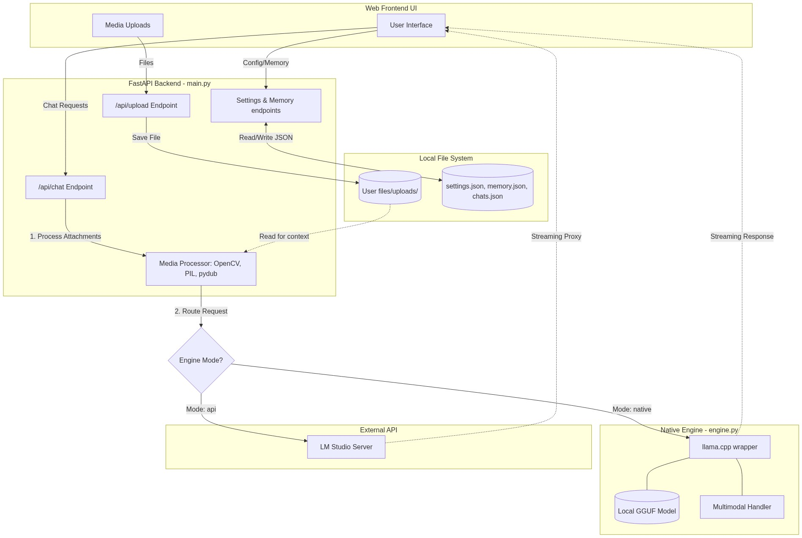
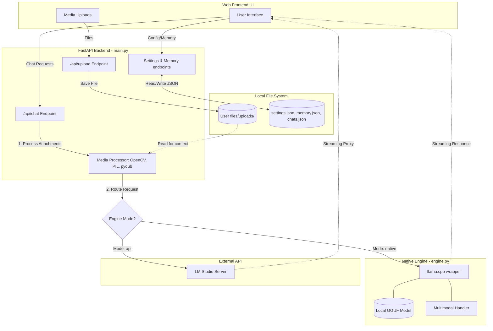

# nivm Architecture Flow

This document outlines the architecture and data flow of the `nivm` application to help you explain its components and interactions to others.

## High-Level Overview

`nivm` is a local AI assistant that acts as a bridge between a web frontend and a Large Language Model (LLM). It provides a flexible FastAPI backend that can operate in two distinct modes:
1.  **Native Engine Mode**: Directly runs models locally using `llama.cpp` and `llama_cpp_python`, providing deep integration for multimodal features (processing images, audio, and video).
2.  **API Proxy Mode**: Acts as a proxy, forwarding requests to an external OpenAI-compatible API, such as a local LM Studio server running on port 1234.

## Architecture Diagram

Here is a visual representation of the system's architecture using standard Mermaid diagram syntax:

Mermaid Source

## Component Breakdown

### 1. Web Frontend (Client)
The user interface where users send messages, adjust settings, and upload media files. It communicates with the backend via REST API endpoints.

### 2. FastAPI Backend (`main.py`)
The core router and logic handler of the application.
-   **Endpoints**: Handles chat requests (`/api/chat`), configuration (`/api/settings`), memory management (`/api/memory`), and file uploads (`/api/upload`).
-   **Media Processor**: A crucial piece of logic inside the chat endpoint. When users upload videos, audio, or animated images, this component uses libraries like `OpenCV`, `PIL`, and `pydub` to extract frames or convert audio into formats that the LLM can understand (base64 encoded representations).
-   **Routing**: Decides where to send the final processed prompt based on the user's `engine_mode` setting.

### 3. Local Storage (`User files/`)
Simple JSON-based file storage for persistence.
-   Stores application settings, saved chats, and a memory key-value store.
-   Holds user-uploaded media temporarily in the `uploads/` directory for processing.

### 4. Native Engine (`engine.py`)
Used when the `engine_mode` is set to `native`.
-   Wraps the `llama_cpp_python` library to load GGUF models directly into the backend's memory.
-   Supports advanced local features like multimodal chat handlers (e.g., for processing images and audio via Llava or Gemma4 architectures) without needing an external server.

### 5. External API Proxy
Used when the `engine_mode` is set to `api`.
-   The backend acts as a transparent proxy, forwarding the OpenAI-compatible chat payload (including base64 encoded images) to an external inference server like LM Studio.
-   It streams the response back to the frontend seamlessly.
